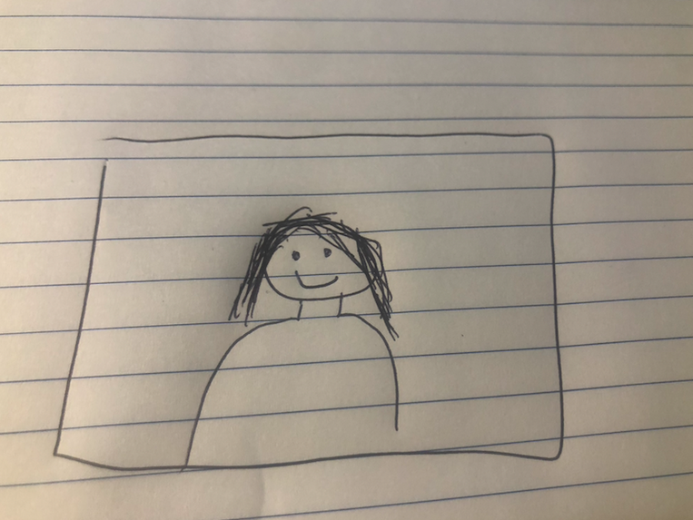
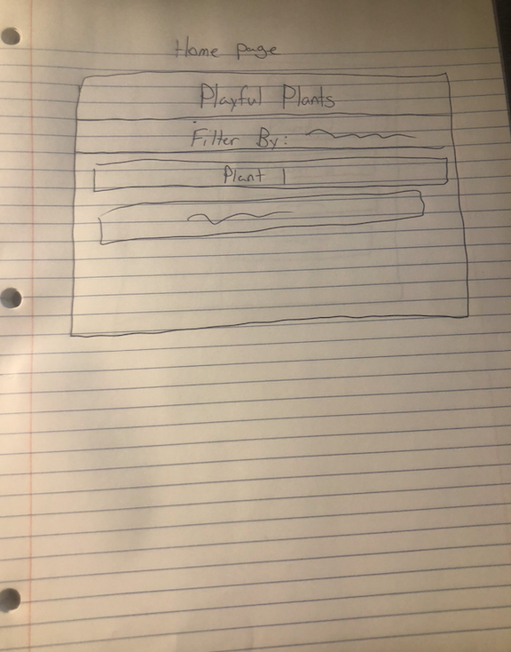
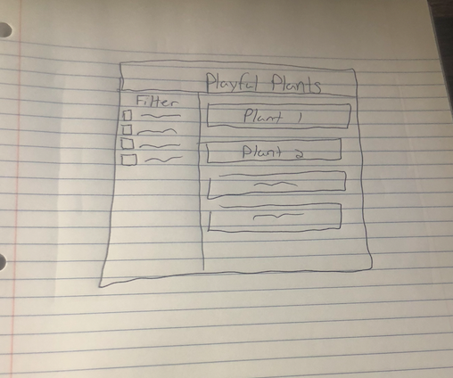

# Project 2: Design Journey

**For each milestone, complete only the sections that are labeled with that milestone.** Refine all sections before the final submission. If you later need to update your plan, **do not delete the original plan, leave it place and append your new plan below the original.** Explain why you are changing your plan. Remember you are graded on your design process. Updating the plan documents your process!

**Replace ALL _TODOs_ with your work.** (There should be no TODOs in the final submission.)

Be clear and concise in your writing. Bullets points are encouraged.

**Everything, including images, must be visible in Markdown Preview.** If it's not visible in Markdown Preview, then we won't grade it. We won't give you partial credit either. **Your design journey should be easy to read for the grader; in Markdown Preview the question and answer should have a blank line between them.**


## Design / Plan (Milestone 1)

**Make the case for your decisions using concepts from class, as well as other design principles, theories, examples, and cases from outside of class (includes the design prerequisite for this course).**

You can use bullet points and lists, or full paragraphs, or a combo, whichever is appropriate. The writing should be solid draft quality.


### Audience (Milestone 1)

> Who is your site's audience? (Yes, this is members of the playful plants project.)
> Briefly explain who the intended audience is for your project website.

The indended audience for this site would be parents with children. These parents would be looking for ways to get their kids outside and provide them with nature play experiences.


### Audience Goals (Milestone 1)

> Document your site's audience's goals.
> List each goal below. There is no specific number of goals required for this, but you need enough to do the job.

Goal 1: Provide children with nature play experiences

- **Design Ideas and Choices** _How will you meet those goals in your design?_
  - Implement a searchable database of playful plants that can support this goal
- **Rationale & Additional Notes** _Justify your decisions; additional notes._
  - If parents are coming to the site, they will need to be able to search around and look for playful plants that will help their children.

Goal 2: Support childrens play & learning

- **Design Ideas and Choices** _How will you meet those goals in your design?_
  - I will provide necessary information within the site that will educate parents in order for them to give this support to their children.
- **Rationale & Additional Notes** _Justify your decisions; additional notes._
- Most parents are not botanists so there has to be information to educate them.


### Persona (Milestone 1)

> Use the goals you identified above to develop a persona of your site's audience.
> Your persona must have a name and a "depiction". This can be a photo of a face or a drawing, etc.
> There is no required format for the persona.
> You may type out the persona below with bullet points or include an image of the persona. Just make sure it's easy to read the persona when previewing markdown.

Persona's Name: Shelby



- Mother with 2 children

- Factors that influence behavior
  - Kids are glued to ipads
  - Does not have much knowledge of nature

- Needs/Obstacles/Desires
  - Needs to know if any plants have potential danger
  - Needs to know where to find plants
  - Obstacle: Not educated on plants whatsoever
  - Desires to give her children an outdoor play experience with nature


### Audience Data (Milestone 1)

> Using your persona, identify the data you need to include in the catalog for your site's audience.
> List the data the audience needs for each plant. (i.e. plant name, etc.)
>
> Hint: You should not include all the data provided. Be selective. Only include the data that advances the audience's goals.

Plant Name (Colloquial)
Plant Name (Genus, Species)
Plant ID
Edible
Visual Interest
Supports Physical Play
Supports Imaginative Play
Loose Parts/Play props
Nooks or Secret Spaces
Provides Opportunities for Climbing & Swinging

### Design Pattern Exploration (Milestone 1)

> Find three (3) example catalog websites (without images).
> For each example, identify elements of the catalog's design that are common among text based catalogs.
> Hint: How is the data presented? How is the data filtered or sorted?

Example Catalog 1: <https://search.google.com/search-console/welcome>

Google Search console presents data in a list format. Data is sorted first by the number of linking pages to your site, and then can also be sorted by how many of your webpages they are linking to.

Example Catalog 2: <https://ahrefs.com/site-explorer>

Ahrefs Site Explorer also presents data in a list format. Data can be sorted by Domain rating, organic traffic to each linking domain, and nofollowed vs dofollowed links.

Example Catalog 3: <https://americanliterature.com/authors>

The American Literature authors catalog displays data in an alphabetical list. There are no ways to sort or filter the authors. It does feature a search option if there is a specific one to be found.


### Site Design (Milestone 1)

> Document your _entire_ design process. **We want to see iteration!**
> **Show us the evolution of your design from your first idea (sketch) to the final design you plan to implement (sketch).**
> Show us the process you used to organize content and plan the navigation, _if applicable_ (card sorting).
> Plan your URLs for the site. (Yes, it's possible for this assignment, you only have one.)
> Provide a brief explanation _underneath_ each design artifact. Explain what the artifact is, how it meets the goals of your personas (**refer to your personas by name**).
> Clearly label the final design.
>
> **Important!** Plan _all_ site requirements. This includes the "add entry" form.

_Initial Designs/Ideas:_

I wanted to make a way for Shelby to be able to filter plants by what she found useful. From there she would be able to learn more and determine whether they could provide a playful experience for her kids.





_Final Design:_




### Design Patterns (Milestone 1)

> Write a one paragraph reflection explaining how you used design patterns for online catalogs in your site's design.

I found my initial design to be aesthetically unpleasing and impractical. I will have the catalog displayed in the main body below the title and to the side of the filter options. After taking pictures, I realized I forgot submit buttons, which will be included in my final implementation. I feel as though my final design gives users like Shelby options to both browse and filter by what content they can see.


## Implementation Plan (Milestone 1, Milestone 2, Final Submission)

**Provide enough detail in your plan that another 2300 student could implement your plan.**

### Database Schema (Milestone 1)

> Describe the structure of your database. You may use words or a picture. A bulleted list is probably the simplest way to do this. Make sure you include constraints for each field.

Table: plants(

- id: INTEGER {PK,U,NN,AI},
- name: TEXT {NN},
- species: TEXT {NN},
- plantid: TEXT {NN},
- edible: TEXT {},
- visual_interest: TEXT {NN},
- visual_interest_description: TEXT {NN},
- physical_play_presence: TEXT {},
- physical_play_description: TEXT {},
- imaginative_play_presence: TEXT {},
- loose_parts: TEXT {},
- loose_parts_description: TEXT {},
- nooks: TEXT {},
- nooks_description: TEXT {},
- climbing_swinging: TEXT {},
- climbing_swinging_description: TEXT {},
)

### Database Query Plan (Milestone 2, Final Submission)

> Plan your database queries. You may use natural language, pseudocode, or SQL.

1. All Records (Milestone 2)

    ```
    SELECT * FROM plantinfo;
    ```

2. Filter/Sort Records (Final Submission)

    ```
    Get HTTP parameters

    $query = "SELECT * FROM plantinfo";
    $params = aray();

    choose where I am querying

    filter = (...)
    query = query filter

    execute query
    ```

3. Insert Record (Final Submission)

    ```
    INSERT INTO table (field1,...)
      VALUES ('value');
    ```


### Code Planning (Milestone 2, Final Submission)

> Plan any PHP code you'll need here using pseudocode.
> Use this space to plan out your form validation and assembling the SQL queries, etc.

```
Set CSS Classes
DB:
Make sure db is connected

$result = exec_sql_query($db, "SQL query");

$records = $result -> fetchAll();

foreach($records as $record) {
  echo htmlspecialchars($record['name'])
}

FORM SUBMISSION:
If form submitted:
  Store http params in variables
  assume form is valid
  check each parameter that is required if it is empty
    form valid = false
    show feedback class
  If form is valid
    show confirmation class
  else (notvalid)
    make sure values are sticky

SORT/FILTER:

SELECT fields FROM table
  If filer section

  WHERE (field [comparison] field/value)
  ORDER BY field asc/desc;

```


### Accessibility Audit (Final Submission)

> Tell us what issues you discovered during your accessibility audit.
> What do you do to improve the accessibility of your site?

I had some background issues with the contrast not being high enough, so I tweaked the background to be more accessible.


## Reflection (Final Submission)

### Audience (Final Submission)

> Tell us how your final site meets the goals of the site's audience. Be specific here. Tell us how you tailored your design, content, etc. to make your website usable for your persona. Refer to the persona by name.

My final site provides the audience with a catalogue that they can sort alphabetically and filter by the aspects of play that the plants provide. Parents, especially Shelby will be able to support their kids with natural play experiences and help them learn in an organic way. The site provides them with all the information they neeed to get their kids playing.


### Additional Design Justifications (Final Submission)

> If you feel like you haven’t fully explained your design choices in the final submission, or you want to explain some functions in your site (e.g., if you feel like you make a special design choice which might not meet the final requirement), you can use the additional design justifications to justify your design choices. Remember, this is place for you to justify your design choices which you haven’t covered in the design journey. You don’t need to fill out this section if you think all design choices have been well explained in the design journey.

N/A


### Self-Reflection (Final Submission)

> Reflect on what you learned during this assignment. How have you improved from Project 1? What would you do differently next time?

My php skills have increased drastically since the first project. I would have started earlier in order to devote more time and make the site look even cooler.


> Take some time here to reflect on how much you've learned since you started this class. It's often easy to ignore our own progress. Take a moment and think about your accomplishments in this class. Hopefully you'll recognize that you've accomplished a lot and that you should be very proud of those accomplishments!

I've been through a lot as we know and the fact that I'm finishing this project is a testament to my dedication to finish this course.
